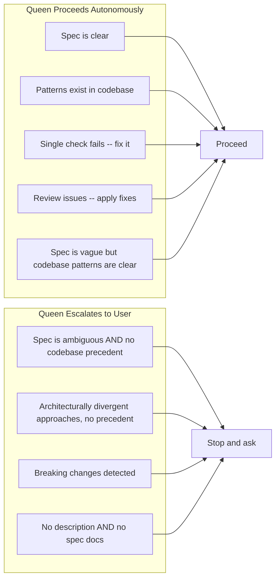
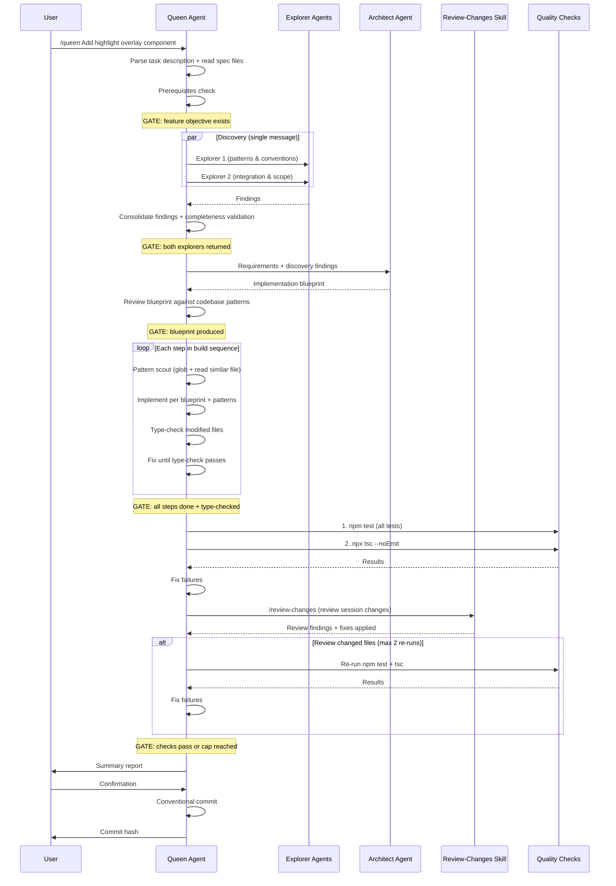

# Queen Agent Orchestration Flow

## Overview

The Queen Agent executes spec-driven feature implementation in five strict phases: Discovery, Architecture Design, Implementation, Quality Gate, Commit. Each phase has an explicit gate -- the next phase does not start until the gate condition is met.

Input is a task description and/or spec files. The task may contain high-level requirements -- the Queen infers completeness expectations from codebase patterns and produces a full, tested implementation.

## Main Flow

```mermaid
flowchart TB
    subgraph Input
        U["User: /queen Add Allegro portal"]
    end

    subgraph Phase0[Phase 0: Requirements Gathering]
        DESC[Parse task description + read spec files]
        REQ[Consolidate requirements summary]
        PREREQ{Prerequisites met?}
        DESC --> REQ --> PREREQ
        PREREQ -->|no description, no docs| ASK[Ask user for details]
        PREREQ -->|has objective| CONTINUE[Proceed]
    end

    subgraph Phase1[Phase 1: Discovery]
        E1["Explorer 1: Patterns & Conventions"]
        E2["Explorer 2: Integration & Scope"]
        CTX[Consolidate findings + completeness validation]
        E1 & E2 -->|return| CTX
    end

    subgraph Phase15["Phase 1.5: Architecture Design"]
        ARCH["Architect agent: produce implementation blueprint"]
        REVIEW[Review blueprint against codebase patterns]
        ARCH --> REVIEW
    end

    subgraph Phase2[Phase 2: Implementation]
        LOOP["FOR EACH step in build sequence"]
        SCOUT["Pattern scout (per new file type)"]
        IMPL[Implement per blueprint + patterns]
        TSC["npx tsc --noEmit (type-check)"]
        FIX_TASK["Fix until type-check passes"]
        LOOP --> SCOUT --> IMPL --> TSC --> FIX_TASK
        FIX_TASK -->|next step| LOOP
    end

    subgraph Phase3[Phase 3: Quality Gate]
        TEST["1. npm test (all tests)"]
        TSC_CHECK["2. npx tsc --noEmit"]
        FIX[Fix failures]
        REVIEW_CODE["/review-changes skill"]
        RERUN{"Changes from review?"}
        CAP{"Re-run count < 2?"}
        TEST --> TSC_CHECK --> FIX --> REVIEW_CODE
        REVIEW_CODE --> RERUN
        RERUN -->|no| DONE[Gate passed]
        RERUN -->|yes| CAP
        CAP -->|yes| TEST
        CAP -->|no| DONE
    end

    subgraph Phase4[Phase 4: Commit]
        SUM[Summary report]
        WAIT[Wait for user confirmation]
        COMMIT[Conventional commit]
        SUM --> WAIT --> COMMIT
    end

    U --> DESC
    CONTINUE --> E1 & E2
    CTX -->|GATE: both explorers returned| ARCH
    REVIEW -->|GATE: blueprint produced| LOOP
    FIX_TASK -->|GATE: all steps done + type-checked| Phase3
    DONE -->|GATE: checks pass or cap reached| SUM
```

## Decision Matrix

## Sequence

## Skills, Agents & Scripts

| Tool                           | Type                    | Purpose                                                                |
| ------------------------------ | ----------------------- | ---------------------------------------------------------------------- |
| Task (`Explore`)               | Parallel agents (x2)    | Codebase patterns, integration points, and scope discovery             |
| Task (`Plan`)                  | Single agent            | Architecture design -- implementation blueprint from high-level spec   |
| `/review-changes`              | Skill (current context) | Code quality review (security, patterns, anti-patterns)                |
| `queen/scripts/test-scoped.sh` | Script                  | Scoped tests + coverage (only touched files) via Vitest                |
| `queen/scripts/test-full.sh`   | Script                  | Full regression tests (all tests related to modified files) via Vitest |
